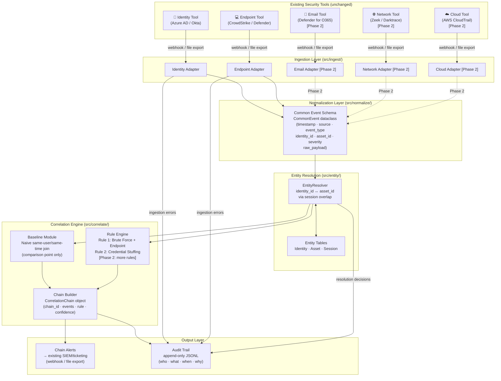

# Architecture: Attack-Chain Correlation Engine

## System Overview

The engine is a **passive correlation layer** — it reads events from existing security tools, correlates them, and writes enriched chain alerts back to the SOC without modifying any existing tool or workflow.

---

## Architecture Diagram

---

## Layer-by-Layer Walkthrough

### 1. Existing Security Tools (Sources)
The five existing tools — identity, endpoint, email, network, cloud — continue operating exactly as before. Nothing changes in these tools. The engine reads from them via:
- **File export:** the tool writes JSON event logs to a shared directory (Phase 1 implementation)
- **Webhook / API:** the tool POSTs events to the engine's ingestion endpoint (Phase 2)

**Graceful degradation:** If a source is unavailable, its adapter returns an empty list. The engine continues with whichever sources are active. A health-check entry is written to the audit trail.

---

### 2. Ingestion Layer (`src/ingest/`)
Each source has its own **adapter** — a thin module that knows how to read from that specific tool's export format. The adapter:
1. Reads raw events (JSON in Phase 1)
2. Validates that required fields are present
3. Returns a list of raw dicts, or logs malformed rows and skips them

**Why separate adapters?** Each security tool has its own field names, timestamp formats, and severity scales. Isolation means adding a new source (e.g., network logs) only requires writing one new adapter file — the rest of the pipeline is unchanged.

---

### 3. Normalization Layer (`src/normalize/`)
All raw events — regardless of source — are mapped to a **single common schema** (`CommonEvent`). This is the most important step: it's what allows the correlation engine to compare an identity event with an endpoint event without knowing their original format.

Fields: `timestamp`, `source`, `event_type`, `identity_id`, `asset_id`, `severity`, `raw_payload`.  
Optional: `identity_id`, `asset_id` (network events may not have a user; endpoint events may not have an identity).

---

### 4. Entity Resolution (`src/entity/`)
After normalization, events reference entities by ID. The resolver builds a **cross-source map**:
- Which `identity_id` values are associated with which `asset_id` values (via login sessions)
- This is what lets the engine link "failed login for alice@corp.com" → "suspicious process on WKSTN-042 where alice was logged in"

**Entity tables:**
- `Identity` — user identifier + display name + department
- `Asset` — hostname + IP + OS type
- `Session` — (identity_id, asset_id, login_time, logout_time) — the join record

**Phase 2 enhancement:** full identity stitching across tools (same person, different username formats).

---

### 5. Correlation Engine (`src/correlate/`)
Two sub-components:

**Baseline module:** Naive join — groups events by the same `identity_id` within a ±0-minute window. No chain logic. This is the comparison point for Phase 2's measured experiment.

**Rule engine:** Evaluates configurable rules against the event stream and entity map. Each rule specifies:
- A sequence of event types (e.g., FAILED_LOGIN × N, then PROCESS_EXEC)
- A time window (e.g., within 10 minutes)
- An entity link requirement (e.g., same identity_id, linked asset)

When a rule fires, a `CorrelationChain` is created.

---

### 6. Output Layer
**Chain alerts:** Written to stdout (Phase 1) or pushed to the existing SIEM via webhook (Phase 2). Contain: chain ID, timeline of events, rule name, confidence.

**Audit trail:** Every decision (ingestion error, entity resolution, rule fire, chain creation) is appended to `audit_trail.jsonl`. Format: `{timestamp, event_type, actor, detail}`. Append-only — records are never modified or deleted.

---

## Rollback / Change-Review Design (Phase 2 Placeholder)

> **This is not implemented in Phase 1. Design documented here for Phase 2.**

High-impact actions (e.g., adding a new correlation rule, modifying entity resolution logic) will follow this workflow:
1. **Propose:** Change is submitted as a PR with the diff of `rules.py` or `resolver.py`
2. **Review:** Security lead approves via a sign-off recorded in `change_log.jsonl`
3. **Deploy:** Rule is activated in "shadow mode" (fires but doesn't alert) for 24 hours
4. **Monitor:** False-positive rate during shadow period compared to baseline
5. **Promote or rollback:** If FP rate is acceptable, rule goes live. Otherwise, reverted and logged.

The audit trail and `change_log.jsonl` together provide the evidence trail required for compliance.

---

## Plug-In Points (Where the Engine Connects to Existing Tools)

| Existing Tool | Connection Method | What the Engine Reads |
|--------------|------------------|----------------------|
| Azure AD / Okta | Webhook (Phase 2) / JSON log export (Phase 1) | Sign-in logs, MFA events |
| CrowdStrike / Defender | JSON log export | Process events, file writes |
| Defender for O365 | JSON log export [Phase 2] | Email click events, attachment downloads |
| Zeek / Darktrace | JSONL log export [Phase 2] | Connection logs, DNS queries |
| AWS CloudTrail | JSON log export [Phase 2] | API calls, role assumptions |

**The engine never writes back to these tools.** It only reads from them. This is a read-only integration — no risk of disrupting existing tooling.
